# 基于Springboot的房产销售系统

## Springboot-0016


## 技术栈

Springboot mybatisplus vue mysql maven


## 数据库表(13张)


## 功能介绍

```properties
使用房产销售系统分为管理员和用户、销售经理三个角色的权限子模块。
管理员所能使用的功能主要有：首页、个人中心、用户管理、销售经理管理、房源信息管理、房源类型管理、房子户型管理、交易订单管理、预约看房管理、评价管理、我的收藏管理、系统管理等。
用户可以实现首页、个人中心、房源信息管理、交易订单管理、预约看房管理、评价管理、我的收藏管理等。
销售经理可以实现首页、个人中心、房源信息管理、交易订单管理、预约看房管理、评价管理等。
```


## 图片

### 前台


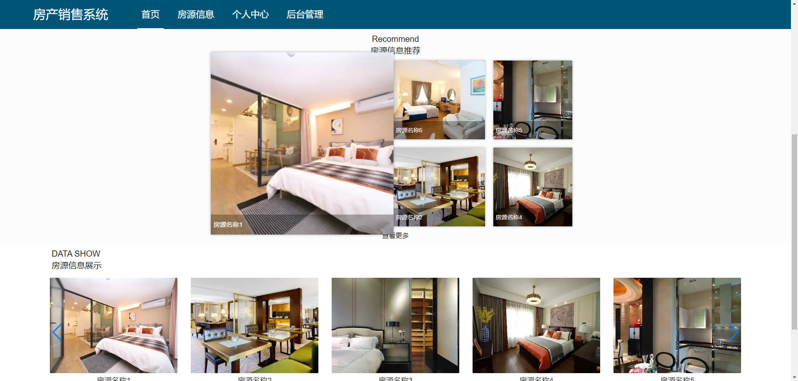


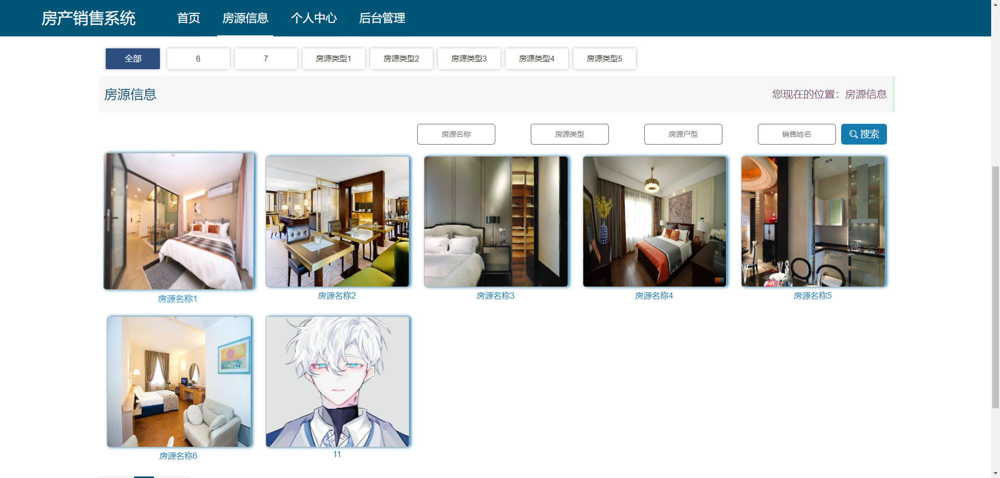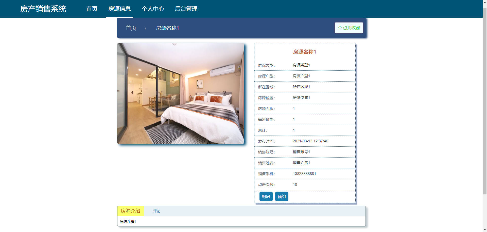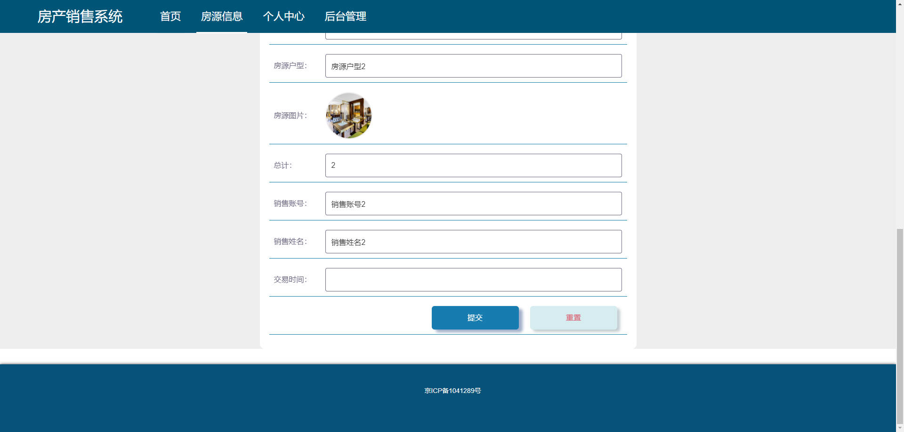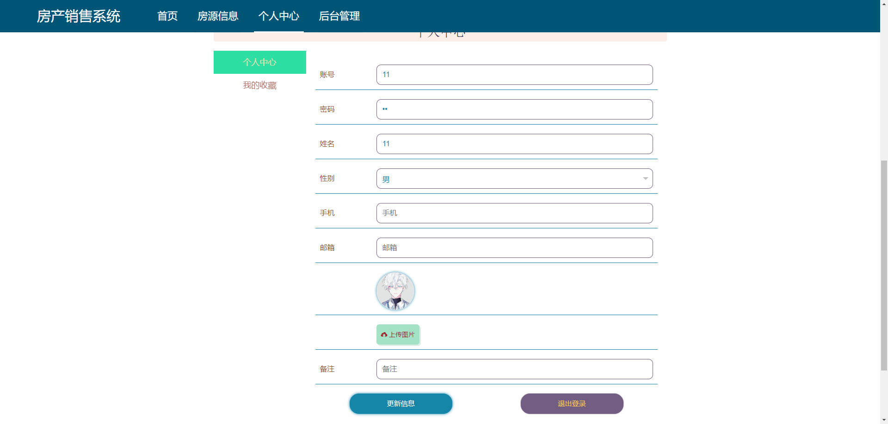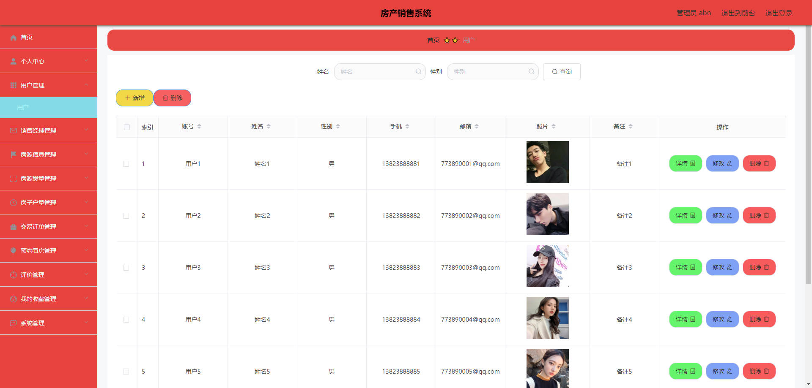

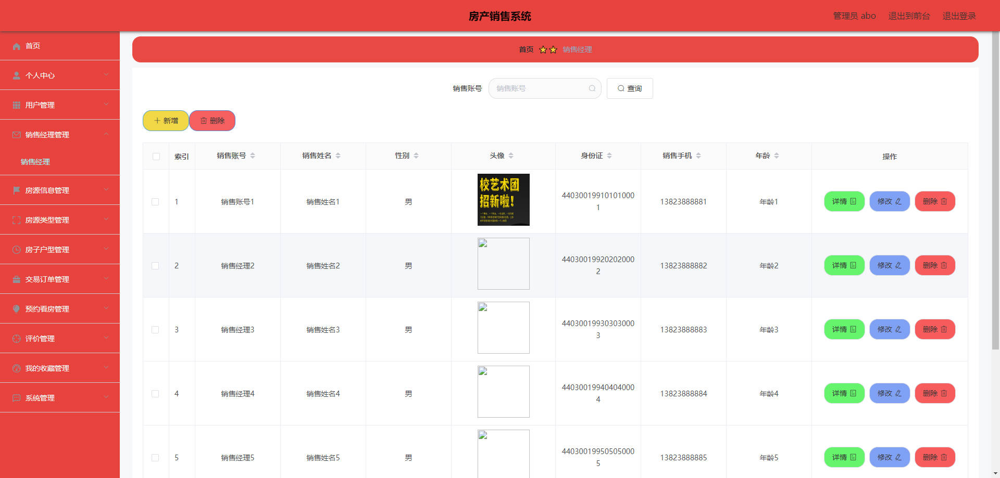

### 后台

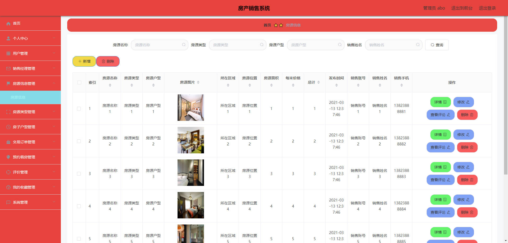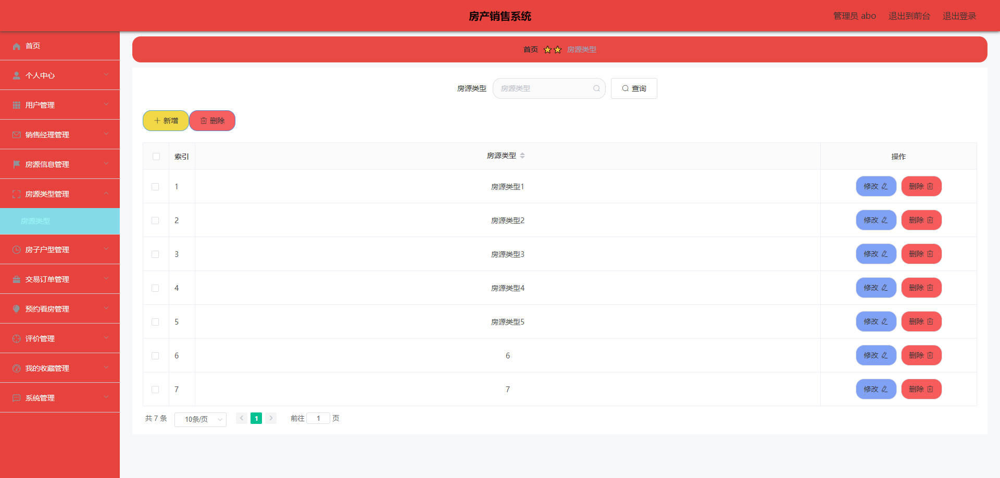

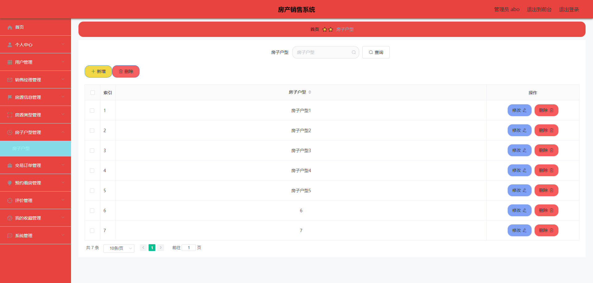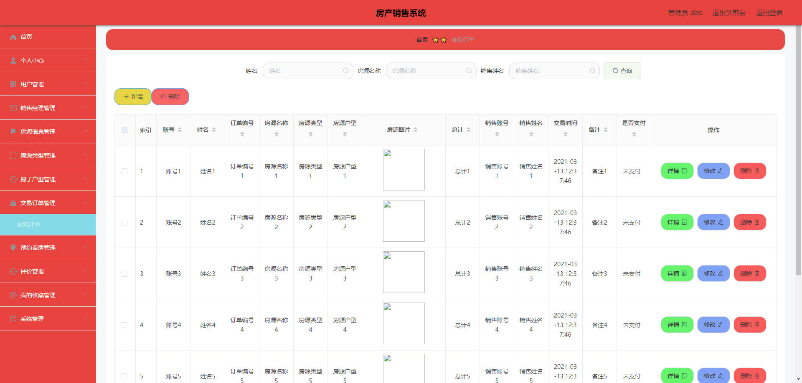


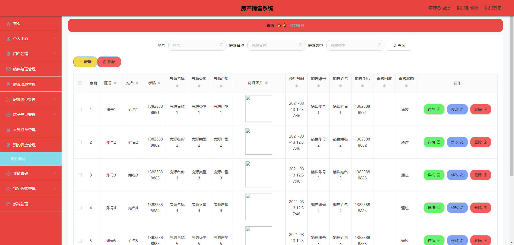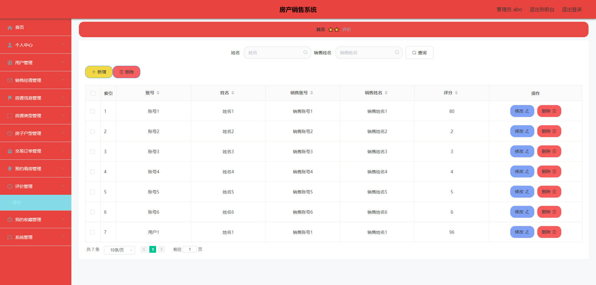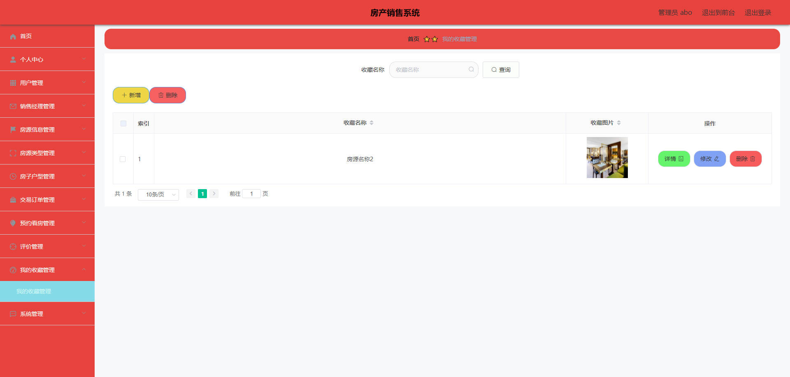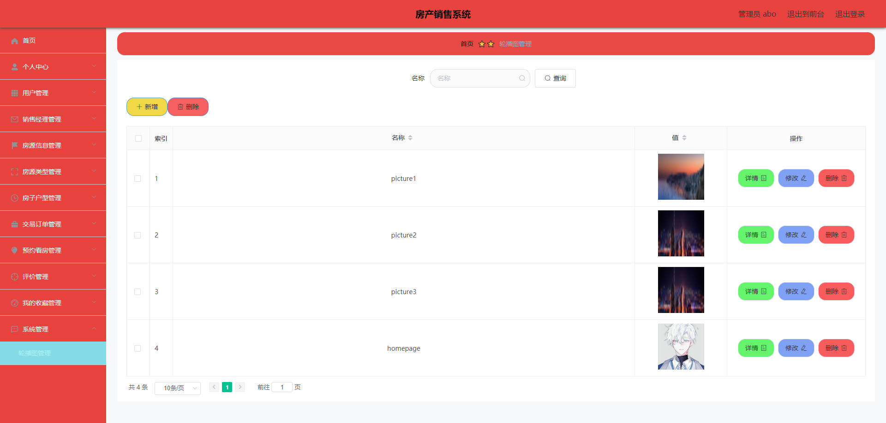


## 访问路径

### 前台

```properties
http://localhost:8080/springbootbqv00/front/pages/login/login.html

账号 11
密码 11
```

### 后台

```properties
http://localhost:8080/springbootbqv00/admin/dist/index.html#/login

账号 abo
密码 abo
```


## 功能图

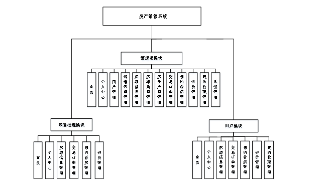


## 文档目录

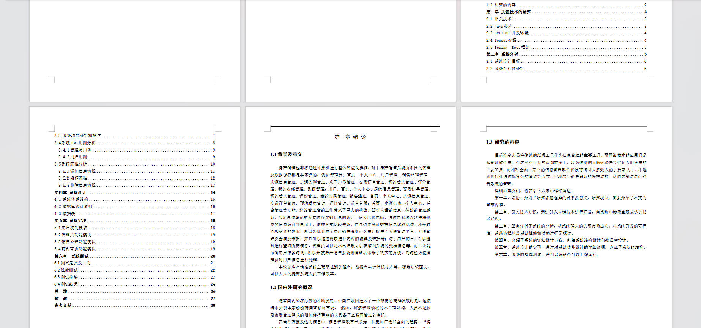


## 打赏或交流


